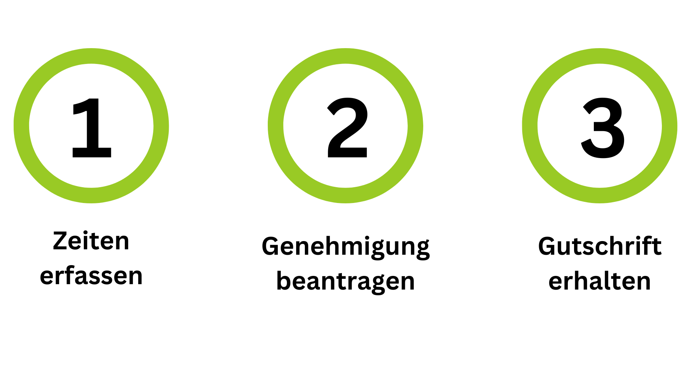

# Gutschriftverfahren

Wenn Sie Zeiten und Ausgaben auf ein Projekt buchen, das zu einer Organisation gehört, dann müssen diese,
in der Regel, in einem Genehmigungsprozess geprüft und genehmigt werden. ZEIT.IO stellt sicher,
dass nur genehmigte Zeiten und Ausgaben in Rechnung gestellt werden können. Eine sehr beliebte Alternative
zur Rechnungserstellung ist das Gutschriftverfahren.

!!! Info
    Das Gutschriftverfahren stellt eine spezielle Art der Abrechnung von Lieferungen und Leistungen zwischen
    einem Kunden und seinem Lieferant dar, bei der die Abrechnungslast nicht vom Lieferanten, sondern vom Kunden selbst
    getragen wird. **Einfach gesagt ist eine Gutschrift eine umgekehrte Rechnung und wird für genehmigte Leistungen
    ausgestellt.**

## Wie funktioniert das Gutschriftverfahren?

Nachdem Sie Ihre Zeiten und/oder Ausgaben auf ein Projekt gebucht haben, beantragen Sie hierfür eine
[Genehmigung](/freiberufler/genehmigungsverfahren).
Wenn Ihr eingereichtes Timesheet (bzw. Ausgabe) genehmigt wird, dann wird in der Regel automatisch eine
Gutschrift ausgestellt. Die Gutschrift wird von der Organisation ausgestellt, die das Projekt betreibt.
Die Gutschrift enthält die gleichen Informationen wie eine Rechnung, nur dass die Abrechnungslast nicht von Ihnen,
sondern von der Organisation getragen wird.

Die Gutschrift können Sie dann in Ihrer Buchhaltung verbuchen, so wie Sie es auch mit einer Rechnung machen würden.
Oder Sie geben die Gutschrift direkt an Ihren Steuerberater weiter.
Sie müssen dann selber aber keine Rechnung mehr schreiben und versenden.

## Vorteile des Gutschriftverfahrens

Das Gutschriftverfahren hat viele Vorteile:

- Sie müssen selber keine Rechnungen schreiben und versenden.
- Sie erhalten die Gutschrift sofort nach der Genehmigung eines Timesheets, bzw. einer Ausgabe. Dies dauert in der Regel
  nur wenige Minuten.
- Geringe Fehleranfälligkeit, da die Gutschrift automatisch ausgestellt wird und die Daten aus dem genehmigten
  Timesheet (Bzw. Ausgabe) und Ihrem ZEIT.IO Vertrag übernommen werden.

## Gutschriftverfahren konfigurieren

Das Gutschriftverfahren können Sie immer per ZEIT.IO Vertrag konfigurieren. Das bedeutet auch, dass Sie in jedem
Vertragsverhältnis eine andere Konfiguration für das Gutschriftsverfahren haben können. Dafür navigieren Sie einfach
zu Ihrem Vertrag.

Wenn Sie angemeldet sind, dann klicken Sie im Hauptmenü, oben links, auf "Verträge".
Dann klicken Sie auf den Vertrag, für den Sie das Gutschriftverfahren konfigurieren wollen. In der
Detailansicht des Vertrags klicken Sie auf den Reiter "Gutschriftverfahren". Hier können Sie dann die
Einstellungen für das Gutschriftsverfahren vornehmen. Folgende Punkte können Sie konfigurieren:

- **Rechtsform & Name**: Sie können Ihre Rechtsform und den offiziellen Namen Ihrer Unternehmung hinterlegen.
- **Adresse**: Die offizielle Anschrift Ihrer Unternehmung.
- **Steuer**: Angaben zu steuerlichen Aspekten, wie z.B. die Steuernummer, USt-IdNr., Umsatzsteuersatz und Kleinunternehmer-Regelung.
- **Sprache**: Die bevorzugte Sprache, Zeitzone und das bevorzugte Datums-Format für die Gutschrift.
- **Zahlungsmodalitäten**: Angaben zur Bankverbindung, Zahlungsziel und Skonto.
- **Gutschrift-Strategie**: Mit einer Checkbox können Sie das Gutschriftverfahren aktivieren oder deaktivieren.

Alle diese Informationen werden dann verwendet, um die nächste Gutschrift zu erstellen.

## FAQs

### Wie kann ich die Rechnungsnummer für Gutschriften konfigurieren?

Sie als Lieferant (Freiberufler/Selbständiger) können die Rechnungsnummer (Nummernkreis) für Gutschriften nicht
konfigurieren. die Rechnungsnummer für Gutschriften wird von der Organisation festgelegt, welche die Gutschrift
ausstellt.

### Wo kann ich "Reverse Charge" für Gutschriften konfigurieren?

Die "Reverse Charge" Regelung ist eine spezielle Steuerregelung, die in der EU für grenzüberschreitende
Dienstleistungen gilt. Die "Reverse Charge" Regelung besagt, dass der Leistungsempfänger die Umsatzsteuer
schuldet, anstatt des Leistenden.

Das "Reverse Charge" Verfahren muss für Gutschriften nicht speziell konfiguriert werden.
ZEIT.IO erkennt automatisch, ob die "Reverse Charge" Regelung für eine Gutschrift angewendet werden muss,
und setzt die Umsatzsteuer, sowie den Hinweis auf "Reverse Charge", entsprechend.

Der Erkennung von "Reverse Charge" basiert auf den Angaben in Ihren Stammdaten. Deswegen ist es sehr wichtig, dass
Sie Ihre Stammdaten korrekt und vollständig hinterlegt haben.

### Ist das Gutschriftverfahren ein Hinweis auf Scheinselbständigkeit?

Nein! Das Gutschriftverfahren an sich ist kein direkter Hinweis auf Scheinselbständigkeit in Deutschland.
Die Scheinselbständigkeit bezieht sich auf die rechtliche Einordnung einer Arbeitsbeziehung, bei der eine
Person als selbständig gilt, obwohl die tatsächlichen Umstände eher auf eine abhängige Beschäftigung hindeuten.

### In welchen Abständen sollte ich Genehmigungen beantragen?

Dies wird in der Regel vom Kunden (Organisation) vorgegeben. Die meisten Organisationen fahren den
Genehmigungsprozess in einem monatlichen Rhythmus. Das bedeutet, dass Sie immer am Ende des Monats
Ihre Zeiten und Ausgaben einreichen zur Genehmigung. Es gibt aber auch Organisationen, die diesen
Prozess wöchentlich oder zweiwöchentlich durchführen.

### Zum Zeitpunkt der Genehmigung war das Gutschriftverfahren nicht aktiviert. Kann ich trotzdem nachträglich eine Gutschrift erhalten?

Ja, das ist möglich. Stellen Sie zuallererst sicher, dass das Gutschriftverfahren in Ihrem Vertrag aktiviert ist!
Wenn dies der Fall ist, dann wenden Sie sich an Ihren Ansprechpartner in der Organisation und bitten Sie um eine
Gutschrift. Die Administratoren der Organisation können auch nachträglich, für genehmigte Timesheets und Ausgaben,
eine Gutschrift ausstellen.

### Ich habe keine Gutschrift erhalten, obwohl mein Timesheet genehmigt wurde. Was kann ich tun?

Wenn das Gutschriftverfahren zum Zeitpunkt der Genehmigung aktiviert war, dann wird in der Regel automatisch eine
eine Gutschrift ausgestellt. In den meisten Fällen dauert dieser Prozess nur ein bis zwei Minuten. In seltenen Fällen
kann es auch mal länger dauern. Wenn Sie nach 15 Minuten immer noch keine Gutschrift erhalten haben, dann kann das
folgende Gründe haben:

- Das Gutschriftverfahren war zum Zeitpunkt der Genehmigung nicht aktiv.
- Die Organisation (Ihr Kunde, der Aussteller der Gutschrift) hat eine verzögerte Gutschrift-Strategie konfiguriert.
  In diesem Fall sollten Sie aber eine automatisierte E-Mail erhalten haben, die Sie darüber informiert wann die
  Gutschrift ausgestellt wird.
- Es gab einen Fehler beim Ausstellen der Gutschrift.

Wenn Sie Fragen dazu haben, dann wenden Sie sich bitte an Ihren Ansprechpartner in der Organisation.
