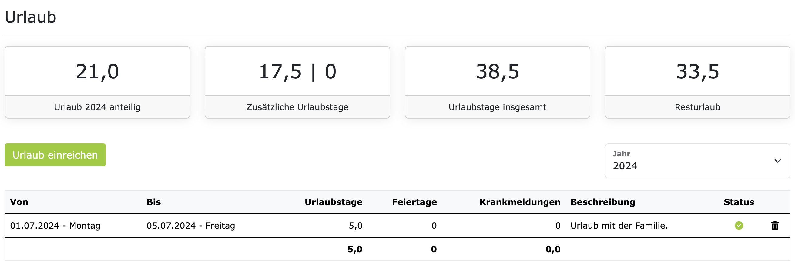

# Urlaube 

Als Mitarbeiter können Sie Urlaubsanträge stellen und einsehen. Im Kontext der Festanstellung 
befinden sich der Punkt "Urlaube" direkt im Hauptmenü. Wenn Sie darauf klicken sehen Sie als
allererstes eine Liste mit den anstehenden Feiertagen, und direkt darunter ist der Bereich für die Urlaube.
Das kann z.B. so aussehen:

Die Kacheln zeigen die wichtigsten Urlaubs-KPIs für das ausgewählte Jahr an. Direkt darunter ist die Liste
mit den eingereichten Urlaubsanträgen. Hier sind die Informationen in den Kacheln von links nach rechts erklärt:

- **Urlaub anteilig**: Die erste Kachel zeigt den anteiligen Urlaub, der Ihnen im ausgewählten Jahr zusteht.
  Dieser ist abhängig von Ihrem Eintrittsdatum und der Anzahl der regulären Urlaubstage pro Jahr, die in Ihrem
  Arbeitsvertrag vereinbart sind.
- **Zusätzliche Urlaubstage**: Die zweite Kachel zeigt die Anzahl der zusätzlichen Urlaubstage an, die Sie
  im ausgewählten Jahr erhalten. In dieser Kachel werden immer zwei Zahlen angezeigt: Die erste Zahl ist die
  Anzahl der Urlaubstage, die aus dem letzten Jahr übertragen wurden, da viele Unternehmen erlauben, dass
  nicht genommene Urlaubstage in das nächste Jahr übernommen werden. Diese zusätzlichen Urlaubstage
  aus dem letzten Jahr haben üblicherweise ein Verfallsdatum, das in den meisten Fällen der 31. März des Folgejahres
  ist. 
  Die zweite Zahl in der Kachel zeigt die Anzahl von gewährten Sonderurlaubstagen an. Für besondere Anlässe, wie z.B.
  Hochzeit, Umzug, Todesfall in der Familie etc., kann Ihnen der Arbeitgeber Sonderurlaub gewähren. Dieser wird
  nicht vom bestehenden Urlaubskontingent abgezogen.
- **Urlaubstage imsgesamt**: Die dritte Kachel zeigt die Anzahl der Urlaubstage an, die Sie im ausgewählten Jahr
  insgesamt zur Verfügung haben. Das ist die Summe aus dem anteiligen Urlaub und den zusätzlichen Urlaubstagen.
- **Resturlaub**: Die vierte Kachel zeigt die Anzahl der Urlaubstage an, die Ihnen noch zur Verfügung stehen. Das ist
  die Differenz aus "Urlaubstage insgesamt" und den bereits eingereichten und genehmigten Urlaubstagen.

## Urlaubsantrag stellen

Um einen Urlaubsantrag zu stellen, klicken Sie auf die Schaltfläche "Urlaub einreichen". Auf der nächsten Seite können
Sie auswählen, ob Sie mehrere Tage, einen Tag oder einen halben Tag  beantragen wollen. Anschließend wählen Sie das 
Start- und Enddatum aus und geben optional eine Begründung ein. Mit dem Klick auf "Speichern" wird der Urlaubsantrag
erstellt.

Standardmäßig müssen Urlaubsanträge von Ihrem Vorgesetzten genehmigt werden. Wenn das für Ihren Vertrag auch so
konfiguriert ist, wird Ihr Vorgesetzter eine E-Mail-Benachrichtigung erhalten und kann den Urlaubsantrag
kommentieren, genehmigen oder ablehnen. Sie werden per E-Mail benachrichtigt, sobald Ihr Vorgesetzter
den Urlaubsantrag bearbeitet hat.

Wenn der Genehmigungsprozess für Urlaubsanträge in Ihrem Vertrag nicht aktiviert ist, dann wird jeder beantragte
Urlaub automatisch genehmigt.

## FAQs

### Wieso kann ich keinen halben Urlaubstag beantragen?

In Deutschland gibt keinen Anspruch auf halbe Urlaubstage wenn es sich um den gesetzlichen Urlaubsanspruch handelt,
da dies dem Ziel der Erholung entgegenstehen würde. Allerdings haben viele Arbeitnehmer mehr Urlaubstage als den
gesetzlichen Anspruch über 20 Tage, und für diese vertraglichen Urlaubstage können Arbeitgeber und Arbeitnehmer im
Arbeitsvertrag vereinbaren, dass halbe Urlaubstage genommen werden dürfen.

Ob Ihnen diese Option in ZEIT.IO zur Verfügung steht, hängt von der Konfiguration Ihres Vertrags ab. Wenn Sie
der Meinung sind, dass Ihnen halbe Urlaubstage zustehen, dann wenden Sie sich bitte an Ihren Vorgesetzten oder
an die Personalabteilung. Diese können die Option auf halbe Urlaubstage in Ihrem Vertrag aktivieren.

### Wie kann ich Sonderurlaub beantragen?

Sie als Arbeitnehmer können keinen Sonderurlaub beantragen, denn dieser wird vom Arbeitgeber gewährt und ist
an besondere Anlässe gebunden, wie z.B. Hochzeit, Umzug, Todesfall in der Familie etc. Wenn Sie der
Meinung sind, dass Ihnen Sonderurlaub zusteht, dann wenden Sie sich bitte an Ihren Vorgesetzten oder an die
Personalabteilung. Diese können prüfen, ob Ihre Anfrage gewährt wird und die entsprechenden Urlaubstage in
ZEIT.IO eintragen.

### Wieso verfallen nicht genommene Urlaubstage am Jahresende?

Ob nicht genommene Urlaubstage am Jahresende verfallen oder nicht hängt von der Konfiguration Ihres Arbeitsvertrags
ab. Wenn Sie der Meinung sind, dass Ihnen nicht genommene Urlaubstage aus dem letzten Jahr zustehen, dann wenden
Sie sich bitte an Ihren Vorgesetzten oder an die Personalabteilung. Diese können prüfen, ob Ihnen die
nicht genommenen Urlaubstage aus dem letzten Jahr in das neue Jahr übertragen werden.

### Wieso verfallen übertragene Urlaubstage aus dem letzten Jahr am 31. März?

Nicht genommene Urlaubstage aus dem letzten Jahr, die in das neue Jahr übertragen wurden, verfallen am 31. März des
neuen Jahres. Das ist die Standardkonfiguration in ZEIT.IO. Allerdings kann das Datum für diese zusätzlichen
Urlaubstage frei angepasst werden. Wenn Sie der Meinung sind, dass das Ablaufdatum für die übertragenen Urlaubstage
angepasst werden sollte, dann wenden Sie sich bitte an Ihren Vorgesetzten oder an die Personalabteilung. Diese können
das Verfallsdatum für die übertragenen Urlaubstage in ZEIT.IO anpassen.
