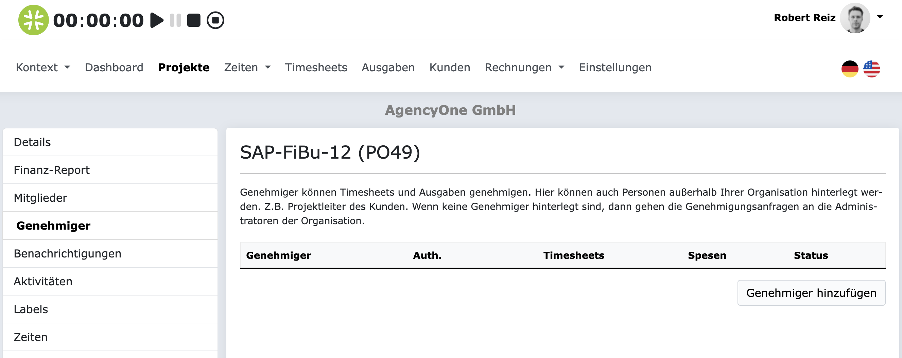
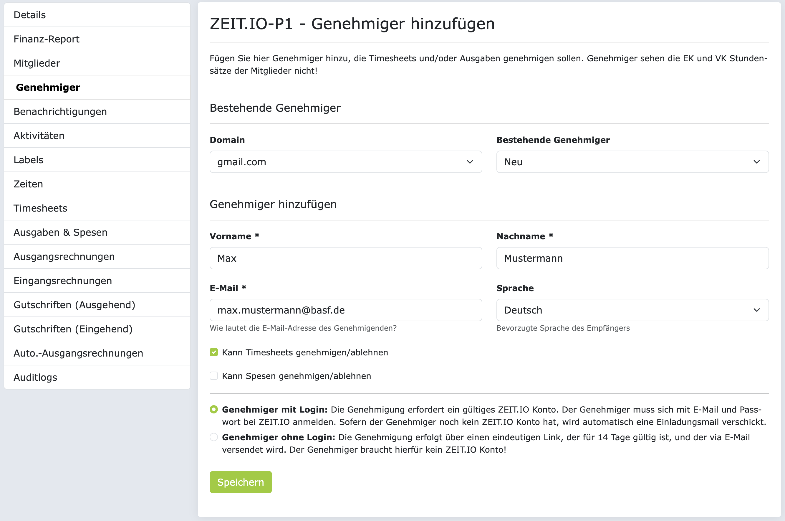

# Genehmiger

Ein Genehmiger ist eine Person, die in einem Projekt, die Genehmigung von Zeiten (Timesheets) und/oder 
Ausgaben übernimmt. Ein Genehmiger kann ein Mitarbeiter Ihres Unternehmens sein, aber auch ein externer 
Freiberufler oder ein Kunde. 

!!! Tip
    Wenn Sie ein Projekt für einen Kunden durchführen, dann bietet es sich an, dass der Kunde die Zeiten und 
    Ausgaben genehmigt, die auf das Kundenprojekt gebucht werden. In dem Fall würden Sie einen Mitarbeiter vom 
    Kunden als Genehmiger, zum Projekt hinzufügen. 

## Genehmiger hinzufügen

Um einen Genehmiger hinzuzufügen, navigieren Sie in das Projekt, in der Sie den Genehmiger 
hinzufügen möchten. Im Seitenmenü auf der linken Seite, klicken Sie auf "Genehmiger". Hier können Sie alle 
Genehmiger sehen, die bereits für das Projekt hinzugefügt wurden und auch neue Genehmiger hinzufügen.

Zum Hinzufügen eines neuen Genehmigers, klicken Sie auf "Genehmiger hinzufügen". Anschließend öffnet sich ein
Formular, in dem Sie die Daten des Genehmigers eintragen können. Wie hier im Beispiel gezeigt mit Max Mustermann:

### Bestehende Genehmiger

Auf der Seite gibt es zwei Unter-Überschriften: "Bestehende Genehmiger" und "Genehmiger hinzufügen". Bei
**"Bestehende Genehmiger"** sind alle Benutzer gelistet die jemals in Ihrer Organisation als Genehmiger eingetragen 
wurden. Diese bestehenden Genehmiger sind nach E-Mail-Domainen organisiert. Wenn Sie eine Domain auswählen, dann 
wird das Dropdown-Menü rechts davon mit den entsprechenden Genehmigern aus der Domaine gefüllt. Wenn Sie einen 
bestehenden Genehmiger aus dem Dropdown-Menü auswählen, dann werden die Felder im Formular automatisch mit den 
Daten des Genehmigers gefüllt. Diese Funktion ist sehr praktisch wenn man den gleichen Genehmiger in mehreren Projekten 
eintragen möchte.

### Genehmiger hinzufügen

Alle Felder unterhalb von **"Genehmiger hinzufügen"** sind Pflichtfelder. Wir brauchen natürlich den Vornamen, 
Nachnamen und die E-Mail-Adresse des Genehmigers. Diese Informationen werden auch auf den Timesheets verwendet, 
um anzuzeigen wer das Timesheet genehmigt hat. 

Mit den Checkboxen können Sie steuern was der Genehmiger genehmigen darf. Also z.B. Timesheets und/oder Ausgaben.
Gerade in größeren Organisationen ist es üblich, dass Timesheets von der Fachabteilung, und Ausgaben/Spesen von der 
Buchhaltung genehmigt werden. In dem Fall würden Sie zwei Genehmiger eintragen, mit unterschiedlichen Rechten.

Ganz unten im Formular sind die Radio-Buttons für die Art des Genehmigers. Grundsätzlich gibt es zwei 
Arten von Genehmigern:

 - Genehmiger mit Login
 - Genehmiger ohne Login

Mehr zu diesen zwei Arten von Genehmigern weiter unten.

Nachdem Sie alle Felder ausgefüllt haben, klicken Sie auf "Speichern". Der Genehmiger wird dann zum Projekt 
hinzugefügt und bekommt eine E-Mail-Benachrichtigung darüber.

Wenn jetzt ein Projekt-Mitglied ein Timesheet zur Genehmigung einreicht, dann werden alle Genehmiger des Projektes, 
die Timesheets genehmigen dürfen, eine E-Mail-Benachrichtigung darüber erhalten, mit einem Link
zum Timesheet. Die Genehmiger können dann auf der Timesheet-Seite alle Details des Timesheets einsehen und 
können dann kommentieren, genehmigen oder ablehnen.

Die Genehmigung von Ausgaben funktioniert analog zu der Genehmigung von Timesheets.

Je nach Konfiguration, kann die Genehmigung eines Timesheets weitere Automatismen auslösen. Wie z.B. die 
Generierung einer Ausgangsrechnung oder einer Gutschrift. 

## Genehmiger mit Login

Ein Genehmiger mit Login ist eine Person, die ein eigenes Benutzerkonto in ZEIT.IO hat. Das bedeutet, dass 
diese Person sich mit Benutzernamen und Passwort in ZEIT.IO anmelden kann und dann Zugriff auf die 
Plattform hat.

Wenn Sie diese Option auswählen und dann auf "Speichern" klicken, dann wird greprüft, ob es bereits einen 
ZEIT.IO Benutzer mit der angegebenen E-Mail-Adresse gibt. Wenn ja, dann wird der Benutzer als Genehmiger 
zum Projekt hinzugefügt und bekommt eine E-Mail-Benachrichtigung darüber. Wenn es noch keinen ZEIT.IO Benutzer
mit der angegebenen E-Mail-Adresse gibt, dann wird eine Einladungsmail an die E-Mail-Adresse verschickt und 
die Person wird aufgefordert sich zu registrieren. Nach der Registrierung wird der Benutzer dann als Genehmiger
zum Projekt hinzugefügt werden.

### Vorteile

Benutzer die als Genehmiger tätig sind, haben ihren eigenen Kontext ("Genehmiger Modus"). In diesem 
Kontext können Genehmiger, organisationsübergreifend, zu allen Projekten wo sie als Genehmiger hinterlegt sind, 
alle gebuchten Zeiten, Timesheets und Ausgaben einsehen und genehmigen. 

 - Der Genehmiger kann hier, auch schon bevor ein Timesheet eingereicht wird, die gebuchten Projektzeiten einsehen. 
 - Der Genehmiger kann hier jederzeit bereits genehmigte und abgelehnte Timesheets/Ausgaben einsehen und hat damit eine Historie.
 - Der Genehmiger kann hier jederzeit sehen wieviele Stunden bereits auf ein Projekt gebucht wurden und wieviele Stunden noch gebucht werden können.
 - **Die Identität des Genehmigers ist durch Benutzernamen und Passwort geschützt!** 

### Nachteile

Der Genehmiger braucht ein Benutzerkonto bei ZEIT.IO. Das bedeutet, dass der Genehmiger sich registrieren muss und 
die AGBs und Datenschutzbestimmungen akzeptieren muss.

## Genehmiger ohne Login

Genehmiger ohne Login sind Personen, die kein eigenes Benutzerkonto bei ZEIT.IO haben. Wenn ein Projekt-Mitglied 
ein Timesheet zur Genehmigung einreicht, dann wird der "Genehmiger ohne Login" eine E-Mail-Benachrichtigung darüber
erhalten. Die E-Mail enthält dann einen eindeutigen Link zum Timesheet. Der Link ist in diesem Fall diesem speziellen 
Genehmiger und Timesheet zugeordnet und wird von ZEIT.IO auch nur an diesen Genehmiger verschickt! Wenn im Projekt 
zwei **Genehmiger ohne Login** eingetragen sind, dann bekommt jeder Genehmiger seinen eigenen Link zum Timesheet 
zugeschickt. 

Der Genehmiger kann dann auf den Link klicken und das Timesheet einsehen, kommentieren, genehmigen oder ablehnen.

### Vorteile

 - Der Genehmiger braucht kein Benutzerkonto bei ZEIT.IO. 
 - Der Genehmiger muss sich kein Benutzernamen und Passwort merken.
 - Der Genehmiger muss keine AGBs und Datenschutzbestimmungen akzeptieren.

### Nachteile

- Der Genehmiger kann nur das Timesheet einsehen, das ihm per E-Mail zugeschickt wurde. Der Genehmiger hat keinen 
  Zugriff auf die Plattform und kann deshalb auch keine Historie einsehen.
- Der Genehmiger kann nicht vorab die gebuchten Projektzeiten einsehen.
- Der Genehmiger kann nicht vorab das Projekt-Budget einsehen. 
- **Die Identität des Genehmigers ist in diesem Fall nicht durch Benutzername und Passwort geschützt.**

!!! warning
    E-Mails werden standardmäßig unverschlüsselt über das Internet versendet. Das bedeutet, dass E-Mails von
    Dritten mitgelesen werden können.

!!! warning 
    Das Timesheet steht, für eine begrenzte Zeit, öffentlich im Netz. Jeder der den Link zum Timesheet kennt, kann 
    das Timesheet einsehen. Das Timesheet ist natürlich nicht über Suchmaschinen auffindbar, aber wenn der Link 
    weitergegeben wird, dann kann das Timesheet auch von Dritten eingesehen, kommentiert, genehmigt oder abgelehnt werden.
    **Die Identität des Genehmigers ist in diesem Fall nicht durch Benutzername und Passwort geschützt.**

## FAQs 

### Kann ich mehrere Genehmiger zu einem Projekt hinzufügen?

Ja, Sie können mehrere Genehmiger zu einem Projekt hinzufügen. Das ist sogar "best practice". Für den Fall, dass
ein Genehmiger mal nicht erreichbar ist, oder im Urlaub ist, oder krank ist, oder das Unternehmen verlässt, 
ist es gut wenn es einen Vertreter gibt, der die Genehmigung übernehmen kann.

### Kann ich die Genehmiger-Rechte nachträglich ändern?

Ja, Sie können die Genehmiger-Rechte nachträglich ändern.

### Kann ich einen Genehmiger wieder entfernen?

Ja, Sie können einen Genehmiger jederzeit wieder aus dem Projekt entfernen.

### Kann ich einen Genehmiger zu mehreren Projekten hinzufügen?

Ja, Sie können einen Genehmiger zu mehreren Projekten hinzufügen. 

### Sehen Genehmiger die Stundensätze der Projekt-Mitglieder?

Nein, Genehmiger sehen die Stundensätze der Projekt-Mitglieder nicht! Die Stundensätze sind nur für bestimmte 
Mitglieder der Organisation sichtbar, die die Rechte dazu haben.

### Sehen Genehmiger die EK und VK Preise der Projekt-Mitglieder?

Nein, Genehmiger sehen weder EK noch VK Preise der Projekt-Mitglieder! Die EK und VK Preise sind nur für bestimmte
Mitglieder der Organisation sichtbar, die die Rechte dazu haben.

### Welche Daten sieht ein Genehmiger auf dem Timesheet?

Ein Genehmiger sieht auf dem Timesheet alle Daten die das Projekt-Mitglied eingetragen hat. Das sind in der Regel:

 - Projektname / Aktivität
 - Projekt-Nummer
 - Datum
 - Start- und Endzeit eines Zeiteintrags
 - Dauer eines Zeiteintrags
 - Tätigkeitsbeschreibung
