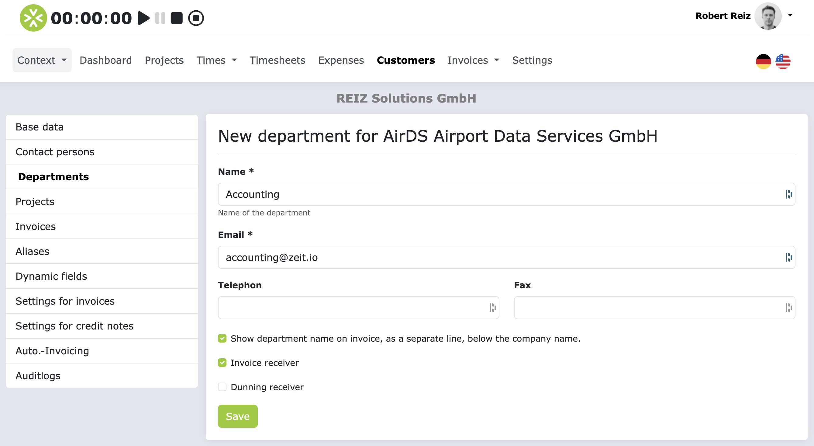

# Customers 

In ZEIT.IO you can create and manage your customers. A customer object can also be in addition to the master data
Contact persons, departments and comments included. A customer object can contain the following elements,
or be linked to these:

- Base data
- Comments
- Contact persons
- Departments
- Projects
- Invoices
- Aliases
- Dynamic fields
- Settings for outgoing invoices
- Settings for credits notes 
- Settings for automatic outgoing invoices
- Auditlogs

Without a customer object, no outgoing invoice can be created. Each invoice must be assigned to a customer object
be. This is important to ensure that the invoice is delivered to the correct address.

## Base data

The base data of a customer object contains the most important information about the customer. This includes: 

- **Customer Number**: A unique number that is automatically generated.
- **VAT ID No.**: The customer's VAT identification number.
- **Name**: The customer's legal name as it should appear on invoices and quotes.
- **Identifier**: A unique name for the customer used in the application. By default, the customer's name is used as the identifier, but the identifier can be different.
- **Address**: The customer's official address.
- **Website**: The customer's website.
- **Email**: The customer's email address.
- **Phone**: The customer's phone number.
- **Fax**: The customer's fax number.
- **Payment term**: Payment term in days. Here you can specify how many days the customer has to pay the invoice. When an invoice is created for the customer, the payment term is automatically included in the invoice.
- **Bank details**: If you have multiple bank details, then you can select the bank details that should apply to this customer here. When an invoice is created for the customer, the bank details are automatically included in the invoice. This is then the bank details to which the customer should make the payment.
- **Supplier number**: If you have received a supplier number from the customer, you can store it here. The supplier number is then automatically included in invoices and offers.
- **Invoice note**: Here you can enter a note that will appear in the invoice module as soon as the customer has been selected. The invoice note is intended for the person who creates the invoice. The invoice note will not be included in the invoice!
- **Active**: With this checkbox you can activate/deactivate the customer. A deactivated customer can no longer be used for new projects or invoices. However, a deactivated customer remains in the database and can also be activated again. It makes sense to deactivate customers that are no longer required in order to shorten the selection lists in the invoice module.

## Comments

You can enter any information about the customer in the comments.
Comments are not public and are only visible to users who have access to your organization.

## Departments

Of course, large customers also have several departments. Each department is responsible for a specific matter.
Quite often there is, for example, a purchasing department, an accounting department, a finance department, and so on. 
departments usually also have a unique name, their own email list and their own telephone number/fax-number.

Accordingly, you can also map your customers’ departments in ZEIT.IO. For projects and invoices
You can then also select the department when assigning the customer. This can influence the
billing address and the recipient email address.

To create a department, please navigate to the desired customer and then click on the left side menu
on “Departments”. Here you can see the list of all existing departments and here you can also create a new one. 
To do this, please click on the “Create new department” button. The form will then appear
like this:

Here you can then enter the name of the department, the email address and the telephone number/fax number.

With the first checkbox you can control whether the name of the department should be used in invoices.
If the checkbox is not active, the name of the department will not appear in invoices.
If the checkbox is activated, then the name of the department will appear in invoices as a separate line below
of the customer name. This can be very important to ensure that the invoice is sent to you
correct department is delivered.

You can also use the last two checkboxes to determine whether this department is an invoice recipient,
or is a reminder recipient.

If a customer object with several contact persons and departments only has one invoice recipient, then when the 
invoice is sent via email, the email address of the invoice recipient is always preset.
When configuring Auto-Invoice in the project, only the invoice recipients appear by default.

When sending invoice reminders, by default only email addresses of departments and contact persons who are marked as 
reminder recipients are used.
