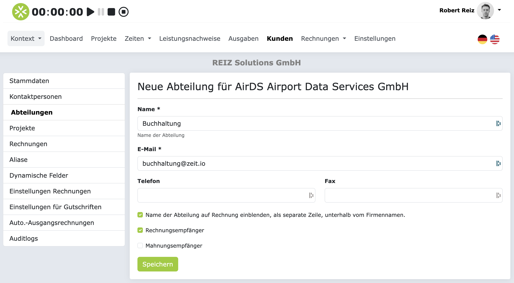

# Kunden

In ZEIT.IO können Sie Ihre Kunden anlegen und verwalten. Ein Kundenobjekt kann neben den Stammdaten auch
Kontaktpersonen, Abteilungen und Kommentare enthalten.

.. more coming soon ..

## Abteilungen

Große Kunden haben natürlich auch mehrere Abteilungen. Jede Abteilung ist für eine bestimmte Sache zuständig.
Ganz oft gibt es z.B. eine Einkaufsabteilung, eine Rechnungsabteilung, eine Finanzabteilung, etc.. Abteilungen
haben in der Regel auch einen eindeutigen Namen, einen eigenen E-Mail-Verteiler und eine eigene Telefonnummer/Faxnummer.

Dementsprechend können Sie auch die Abteilungen Ihrer Kunden in ZEIT.IO abbilden. Bei Projekten und Rechnungen
können Sie dann, bei der Kundenzuordnung, auch die Abteilung auswählen. Das kann dann einen Einfluss auf die
Rechnungsadresse haben und auf die Empfänger-E-Mail-Adresse.

Um eine Abteilung anzulegen, navigieren Sie bitte zu dem gewünschten Kunden und klicken dann links im Seitenmenü
auf "Abteilungen". Hier sehen Sie die Liste aller vorhandenen Abteilungen und hier können Sie auch eine neue
Abteilung anlegen. Dafür klicken Sie bitte auf den Button "Neue Abteilung anlegen". Das Formular dazu sieht dann
so aus:

Hier können Sie dann den Namen der Abteilung, die E-Mail-Adresse und die Telefonnummer/Faxnummer hinterlegen.

Mit der ersten Checkbox können Sie kontrollieren, ob der Name der Abteilung in Rechnungen verwendet werden soll.
Wenn die Checkbox nicht aktiv ist, dann taucht der Name der Abteilung nicht in Rechnungen auf.
Wenn die Checkbox aktiviert ist, dann wird der Name der Abteilung, in Rechnungen, als separate Zeile, unterhalb
des Kunden-Namens, aufgeführt. Dies kann sehr wichtig sein, um sicherzustellen dass die Rechnung auch an die
richtige Abteilung zugestellt wird.

Außerdem können Sie mit den zwei letzten Checkboxen festlegen, ob diese Abteilung ein Rechnungs-Empfänger,
bzw. ein Mahnungs-Empfänger ist. 
